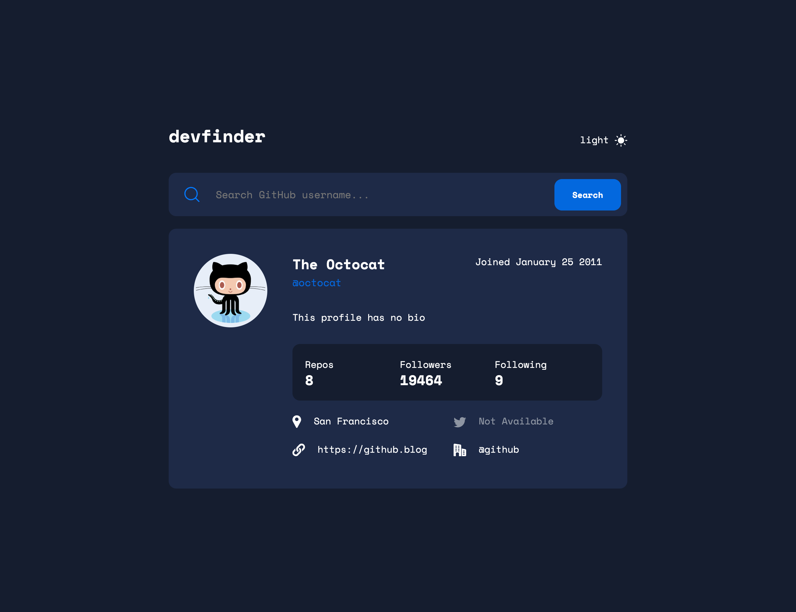

# Frontend Mentor - GitHub user search app solution

This is a solution to the [GitHub user search app challenge on Frontend Mentor](https://www.frontendmentor.io/challenges/github-user-search-app-Q09YOgaH6). Frontend Mentor challenges help you improve your coding skills by building realistic projects.

## Table of contents

- [Overview](#overview)
  - [The challenge](#the-challenge)
  - [Screenshot](#screenshot)
  - [Links](#links)
- [My process](#my-process)
  - [Built with](#built-with)
- [Author](#author)

**Note: Delete this note and update the table of contents based on what sections you keep.**

## Overview

### The challenge

Users should be able to:

- View the optimal layout for the app depending on their device's screen size
- See hover states for all interactive elements on the page
- Search for GitHub users by their username
- See relevant user information based on their search
- Switch between light and dark themes
- **Bonus**: Have the correct color scheme chosen for them based on their computer preferences. _Hint_: Research `prefers-color-scheme` in CSS.

### Screenshot

### Links

- Solution URL: [https://github.com/ClaytonDewey/fem-github-user-search](https://github.com/ClaytonDewey/fem-github-user-search)
- Live Site URL: [https://claytondewey.github.io/fem-github-user-search/](https://claytondewey.github.io/fem-github-user-search/)

## My process

### Built with

- Semantic HTML5 markup
- CSS custom properties
- Sass/SCSS
- Mobile-first workflow
- [React](https://reactjs.org/) - JS library

**Note: These are just examples. Delete this note and replace the list above with your own choices**

## Author

- Website - [claytondewey.com](https://www.claytondewey.com)
- Frontend Mentor - [@ClaytonDewey](https://www.frontendmentor.io/profile/ClaytonDewey)
